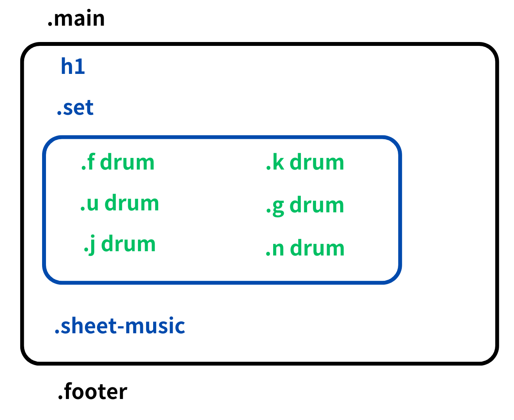
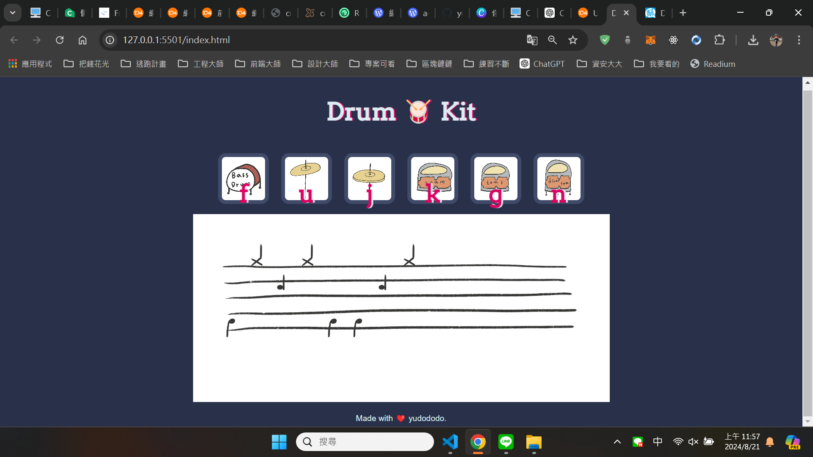

## Overview👀

在高中時期加入了熱音社，學習了如何打擊爵士鼓。此為一個簡易鼓譜生成器

## Layout🌼

  

## Screenshot🐻💥

  

 

## The challenge🔥

利用了 HTML、CSS 和 JavaScript 的基本技術來創建一個爵士鼓組模擬器。用戶可以通過點擊按鈕或按下鍵盤來播放不同的鼓聲，並且在點擊按鍵時網頁下的樂譜會顯示相應的音符。
